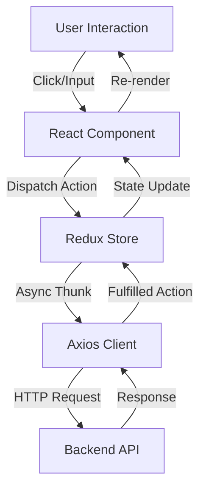

# Frontend Architecture

## Overview
The **WaysBean Frontend** is a Single Page Application (SPA) built with **React** and **TypeScript**, bundled by **Vite**. It utilizes **Redux Toolkit** for global state management and **Chakra UI** for a polished, responsive component library.

## Architectural Layers

1.  **View Layer (Components & Pages)**
    - **Pages**: Top-level route components (e.g., `Home`, `ProductDetail`).
    - **Components**: Reusable UI blocks (e.g., `Navbar`, `ProductCard`).
    - **Layouts**: Wrapper components for standardized page structure.

2.  **State Management Layer (Redux)**
    - **Slices**: Modular state logic (e.g., `authSlice`, `cartSlice`).
    - **Thunks**: Async logic for API calls.

3.  **Data Access Layer (API Integration)**
    - **Axios**: Configured HTTP client with interceptors for auth tokens.
    - **Hooks**: Custom hooks (e.g., `useAuth`, `useCart`) to abstract data fetching.

## Key Technologies
- **Routing**: `react-router-dom` handles client-side navigation.
- **Forms**: `react-hook-form` with `zod` validation schema.
- **Real-time**: `socket.io-client` listens for backend events.

## Data Flow

## Directory Structure
- `src/assets`: Static images and global styles.
- `src/components`: Shared UI components.
- `src/hooks`: Custom React hooks.
- `src/pages`: Application views.
- `src/store`: Redux setup (store, rootReducer, slices).
- `src/utils`: Helper functions (formatting, validation).
